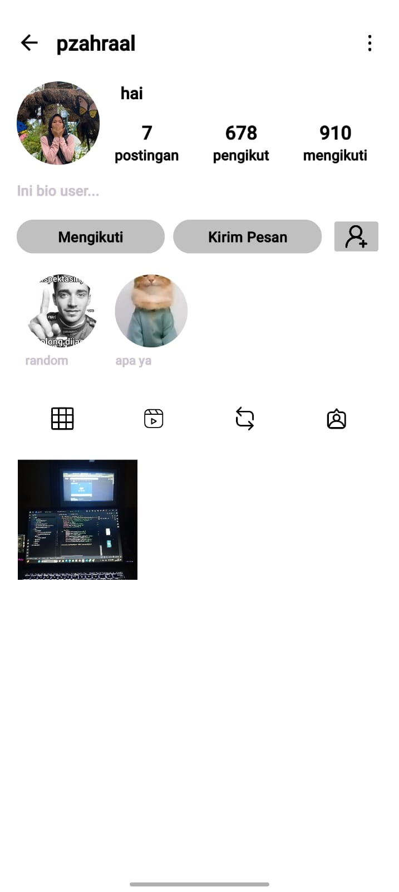
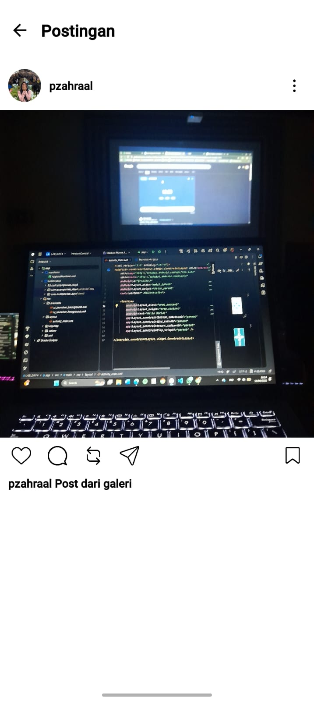
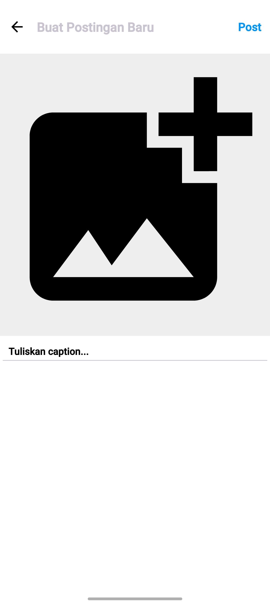

# Tugas Praktikum 3 - Aplikasi Instagram Clone dengan RecyclerView

> **Nama:** Zahra Aulia Putri  
> **NIM:** H071241025 

---

## 📱 Deskripsi Aplikasi

Aplikasi ini merupakan clone sederhana Instagram yang menggunakan RecyclerView dengan beberapa variasi layout.

Aplikasi memiliki 3 halaman utama:

1. Home (Feed) → menampilkan postingan user
2. Profile → menampilkan profil, grid post, dan highlight story
3. Post (Upload) → upload gambar + caption

---

## ✅ Fitur Aplikasi

### 📌 Home Feed
- RecyclerView vertical (scroll feed)
- Dengan 10 data dummy
- Klik foto profil → Profile user
- Klik username → Profile user
- Klik post → Detail Feed

### 📌 Profile
- UI seperti Instagram (foto, bio, stats)
- Grid RecyclerView (min 5 post)
- Klik post → Detail Feed
- Horizontal RecyclerView highlight story (dengan 7 dummy story di dalam highlight)
- Klik highlight → Detail Story

### 📌 Post (Upload)
- Ambil gambar dari galeri
- Tambah caption
- Post muncul di Profile
- Data disimpan dengan SharedPreferences

---

## 🏗️ Struktur Project

### 📁 Package & Class

```text
com.example.tp2/
- MainActivity.java
- ProfileActivity.java
- PostActivity.java
- DetailFeedActivity.java
- DetailStoryActivity.java
- StoryDetailActivity.java

- DummyData.java
- Feed.java
- Highlight.java
- Story.java

- HomeFeedAdapter.java
- FeedAdapter.java
- HighlightAdapter.java
- MainAdapter.java
```

---

### 📁 Layout Files

| Layout | Fungsi |
|--------|--------|
| activity_main.xml | Home Feed |
| activity_profile.xml | Profile |
| activity_post.xml | Upload Post |
| activity_detail_feed.xml | Detail Feed |
| activity_detail_story.xml | Detail Story |
| item_home_feed.xml | Item Home Feed |
| item_feed.xml | Grid Profile |
| item_highlight.xml | Highlight |
| item_header.xml | Header |
| item_story_container.xml | Story container |

---

## 📊 Data Dummy

### Feed
- Home: 10+ postingan dari 2 user
- Profile: 5+ postingan per user

### Highlight
- 2 highlight
- masing-masing 7 story

### User
| Username | Profile |
|----------|--------|
| lambe_turah | profile1 |
| makassar.info | profile2 |
| pzahraal | profile (aktif) |

---

## 🔄 Alur Navigasi

Home:
- Klik user → Profile
- Klik post → Detail Feed

Profile:
- Klik post → Detail Feed
- Klik highlight → Detail Highlight

Post:
- Upload → kembali ke Profile

---

## 💾 Penyimpanan Data

```java
SharedPreferences prefs = getSharedPreferences("posts", MODE_PRIVATE);
prefs.edit().putString("last_post", imageUri.toString()).apply();
```

Dimuat ulang di `onResume()` ProfileActivity.

---

## 🛠️ Cara Menjalankan

1. Buka project di Android Studio
2. Minimum SDK 21+
3. Run di emulator / device
4. Izinkan akses galeri

---

## 📚 Library

- RecyclerView
- AppCompat
- Activity Result API

---

## ⚠️ Catatan

- Hanya 1 post terakhir yang tersimpan
- URI gambar harus tetap ada di galeri

---

## 📸 Screenshot Tampilan Aplikasi

### Home Feed


### Profile



### Detail Feed



### Detail Highlight


### Halaman Post


---

## 👨‍💻 Kesimpulan

Aplikasi ini mengimplementasikan:
- RecyclerView vertical, grid, horizontal
- Multi Activity navigation
- Upload image dari galeri
- Data dummy + dynamic data

---

**Sekian & Terima Kasih**