# 📚 ZaemLib - Library App

> **Nama:** Zahra Aulia Putri  
> **NIM:** H071241025  

---

# 📌 Latar Belakang

Aplikasi ini merupakan **pengembangan** dari Tugas Praktikum 3 (Library App dasar) dan Praktikum 4 (penambahan background thread + ProgressBar). Pada Tugas Praktikum 5 ini, ditambahkan fitur:

- 🔐 **Login & Register** (SharedPreferences)
- 🌙 **Dark/Light Mode** (toggle tema)
- 👤 **Session Management** (logout)

---

# 📱 Deskripsi Aplikasi

**ZaemLib** adalah aplikasi manajemen buku digital berbasis Android yang memungkinkan pengguna untuk:

- 🔐 Login & Register dengan username & password
- 🌙 Mengubah tema terang/gelap sesuai preferensi
- 📚 Melihat daftar buku 
- 🔍 Mencari, memfilter genre, dan mengurutkan buku
- ⭐ Menandai buku favorit
- 📖 Menambah buku baru dengan cover dari galeri
- 📝 Melihat detail lengkap buku (rating + review)

---

# ✅ Fitur Aplikasi

## 🔐 Autentikasi (Login & Register)

| Fitur | Keterangan |
|---|---|
| Register | Username + password + konfirmasi password |
| Validasi | Password minimal 4 karakter, username unik |
| Login | Cek kecocokan username & password dengan data terdaftar |
| Session | Login tersimpan di SharedPreferences |
| Logout | Hapus session, kembali ke halaman login |

---

## 🌙 Dark Mode

| Fitur | Keterangan |
|---|---|
| Toggle | Di halaman Settings (RadioButton Terang/Gelap) |
| Coverage | Semua halaman (Home, Detail, Add Book, Favorites, Settings) |
| Persistence | Tersimpan otomatis, tetap berlaku setelah restart aplikasi |

---

## 👁️ Show/Hide Password

| Fitur | Keterangan |
|---|---|
| Icon mata | Di field password dan konfirmasi password |
| Toggle | Klik icon untuk menampilkan/menyembunyikan password |

---

# 📌 Halaman Utama

## 1. 🏠 Home (Daftar Buku)

- RecyclerView vertical dengan 15+ data buku dummy
- SearchView (cari berdasarkan judul atau penulis)
- Filter berdasarkan genre (multi-genre)
- Sorting:
  - Tahun terbaru
  - Tahun terlama
  - Judul A-Z
  - Judul Z-A
- Klik buku → `DetailActivity`
- Background thread (`AsyncTask`) + `ProgressBar` saat loading

---

## 2. ⭐ Favorites

- Menampilkan buku yang sudah di-like
- Auto refresh saat fragment tampil
- Background thread (`AsyncTask`) + `ProgressBar` saat loading

---

## 3. ➕ Add Book

- Input:
  - Judul
  - Penulis
  - Tahun
  - Genre
  - Deskripsi
- Ambil cover dari galeri (izin storage otomatis)
- Preview gambar sebelum disimpan
- Buku baru muncul di paling atas halaman Home

---

## 4. ⚙️ Settings

- Menampilkan username yang sedang login
- Pilihan tema:
  - Terang
  - Gelap
- Tombol Logout untuk keluar dari session

---

# 📖 Halaman Detail Buku

- Info lengkap buku:
  - Judul
  - Penulis
  - Tahun
  - Genre
  - Sinopsis
- Cover buku (dari galeri atau default)
- Rating numerik (4.0 - 4.9 tergantung buku)
- 2 review realistis dengan:
  - Nama reviewer
  - Tanggal
  - Rating bintang
  - Isi review
- Tombol Like / Unlike (sinkron dengan halaman Favorites)

---

# 🏗️ Struktur Project

## 📁 Package & Class

```text
com.example.tp5/
├── LoginActivity.java              // Halaman login
├── RegisterActivity.java           // Halaman registrasi
├── MainActivity.java               // Main + Bottom Navigation
├── DetailActivity.java             // Detail buku
├── FragmentHome.java               // Halaman Home (dengan AsyncTask)
├── FavoritesFragment.java          // Halaman Favorites (dengan AsyncTask)
├── AddBookFragment.java            // Form tambah buku
├── SettingsFragment.java           // Halaman pengaturan (tema + logout)
├── Book.java                       // Model buku
├── BookAdapter.java                // Adapter RecyclerView
├── PrefManager.java                // SharedPreferences helper
├── DataDummy.java                  // Data dummy buku (15+)
└── ...
```

---

## 📁 Layout Files

| File | Fungsi |
|---|---|
| activity_login.xml | Halaman login |
| activity_register.xml | Halaman registrasi |
| activity_main.xml | Main + Bottom Navigation |
| activity_detail.xml | Detail buku |
| fragment_home.xml | Halaman Home |
| fragment_favorites.xml | Halaman Favorites |
| fragment_add_book.xml | Form tambah buku |
| fragment_settings.xml | Halaman pengaturan |
| item_book.xml | Item RecyclerView buku |

---

# 🔐 Cara Kerja Autentikasi

## SharedPreferences (`PrefManager.java`)

```java
// Method utama
registerUser(username, password)   // Simpan user baru
checkLogin(username, password)     // Verifikasi login
isLoggedIn()                       // Cek session
logout()                           // Hapus session
setThemeMode(mode)                 // Simpan preferensi tema
getThemeMode()                     // Ambil preferensi tema
```

---

## 🔄 Flow Login

```text
Launch App → LoginActivity → Input Username & Password
    ↓
Cek ke SharedPreferences
    ↓
Jika benar → MainActivity → Home
Jika salah → Toast "Username atau password salah!"
```

---

## 📝 Flow Register

```text
RegisterActivity → Input Username, Password, Konfirmasi Password
    ↓
Validasi: minimal 4 karakter, password cocok, username unik
    ↓
Simpan ke SharedPreferences → Langsung login → MainActivity
```

---

# 🌙 Cara Kerja Dark Mode

## Di setiap Activity (sebelum `setContentView`)

```java
PrefManager prefManager = new PrefManager(this);

if (prefManager.getThemeMode() == 1) {
    setTheme(R.style.Theme_Tp5_Dark);
} else {
    setTheme(R.style.Theme_Tp5);
}
```

---

## Toggle di `SettingsFragment`

```java
rgTheme.setOnCheckedChangeListener((group, checkedId) -> {

    if (checkedId == R.id.rb_dark) {

        prefManager.setThemeMode(1);
        AppCompatDelegate.setDefaultNightMode(MODE_NIGHT_YES);

    } else {

        prefManager.setThemeMode(0);
        AppCompatDelegate.setDefaultNightMode(MODE_NIGHT_NO);
    }

    requireActivity().recreate();
});
```

---

## 🎨 Tema yang Digunakan

| Mode | Background | Text | Primary Color |
|---|---|---|---|
| Light | #EADDDA | #1C1B1F | #D58718 |
| Dark | #121212 | #E0E0E0 | #5C3A0A |

---


# 💾 Penyimpanan Data

| Jenis Data | Teknologi |
|---|---|
| Session login & tema | SharedPreferences |
| Data user terdaftar | SharedPreferences |
| Data buku (dummy + tambahan) | ArrayList |

---

# 🛠️ Cara Menjalankan

1. Buka project di Android Studio
2. Pastikan Minimum SDK: API 21
3. Sync Gradle (tunggu hingga selesai)
4. Run di emulator atau device fisik
5. Izinkan akses galeri saat pertama kali membuka Add Book
6. Register akun baru atau Login dengan akun yang sudah terdaftar

---

# 📸 Screenshot Aplikasi

### Light Mode
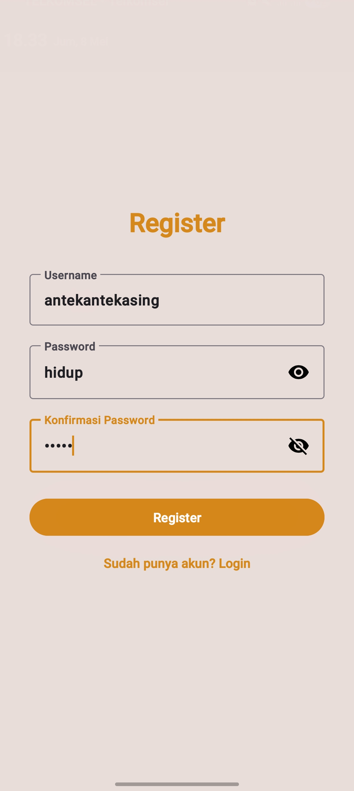
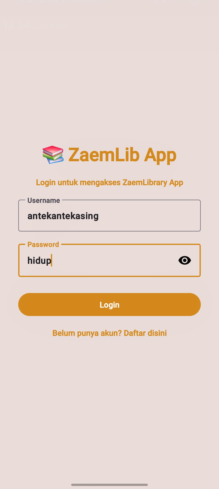
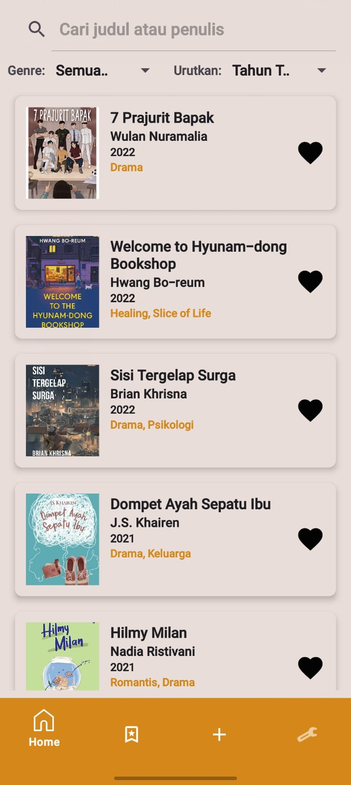
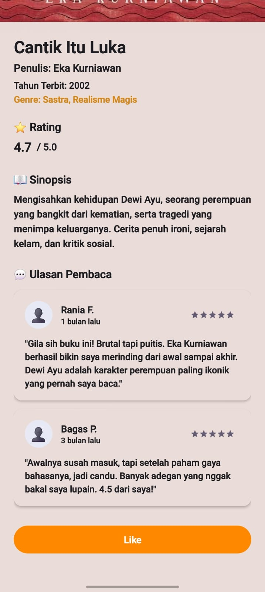
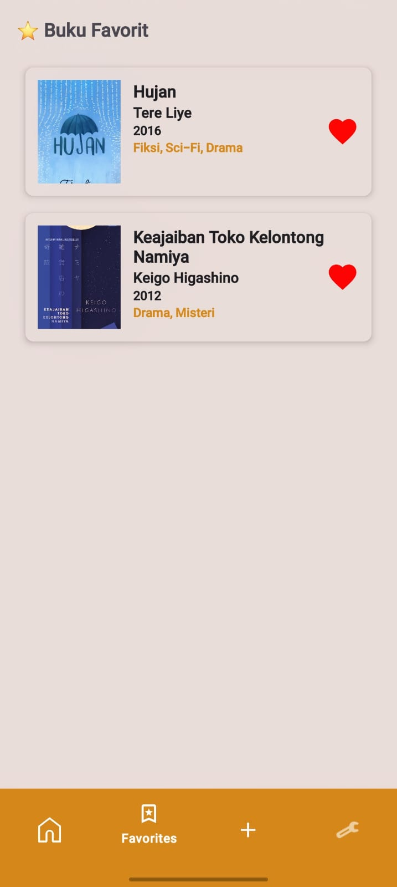
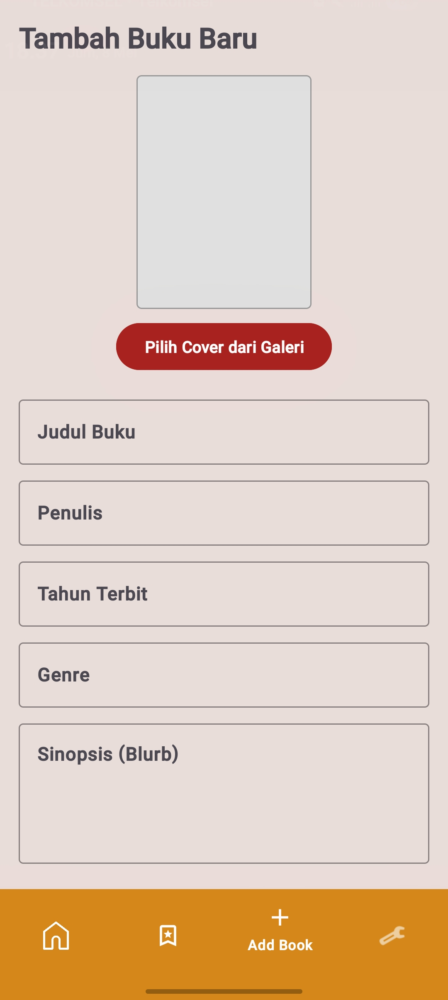
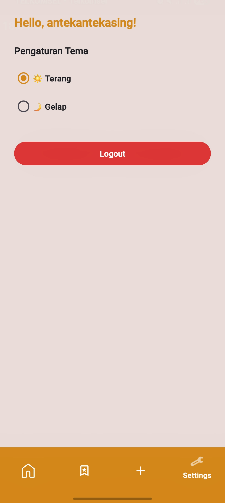

### Dark Mode
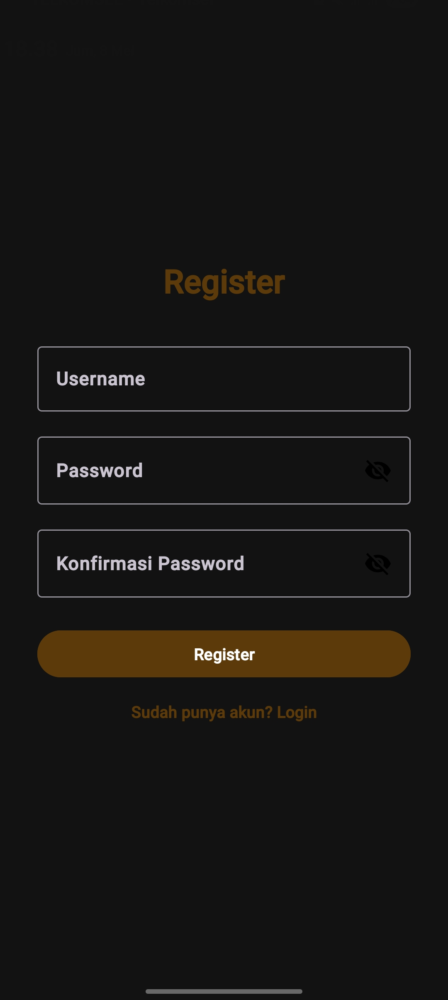
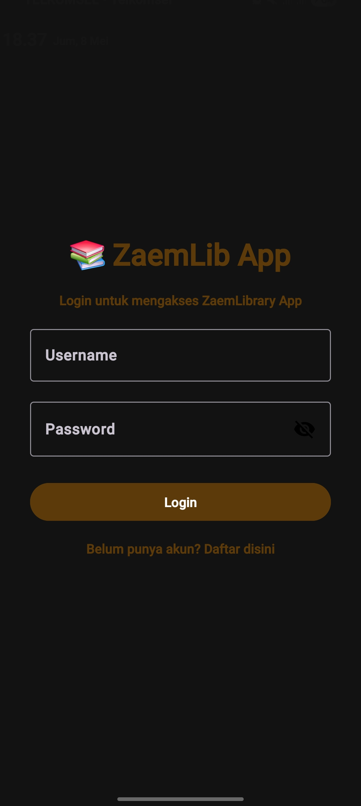
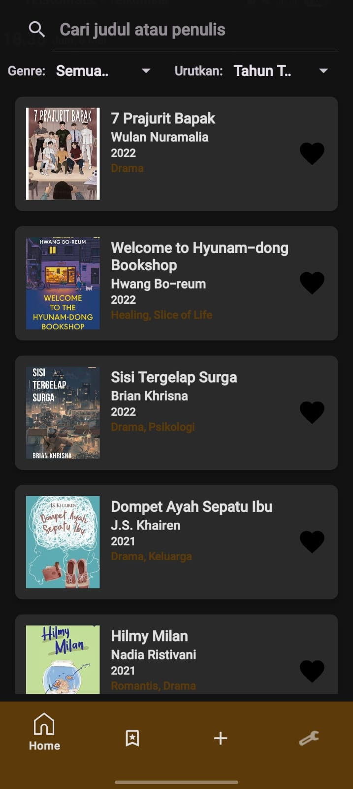
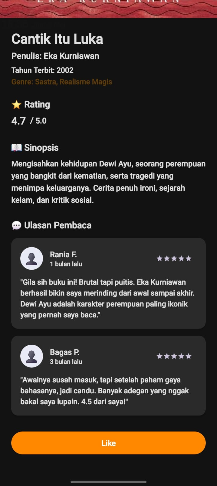
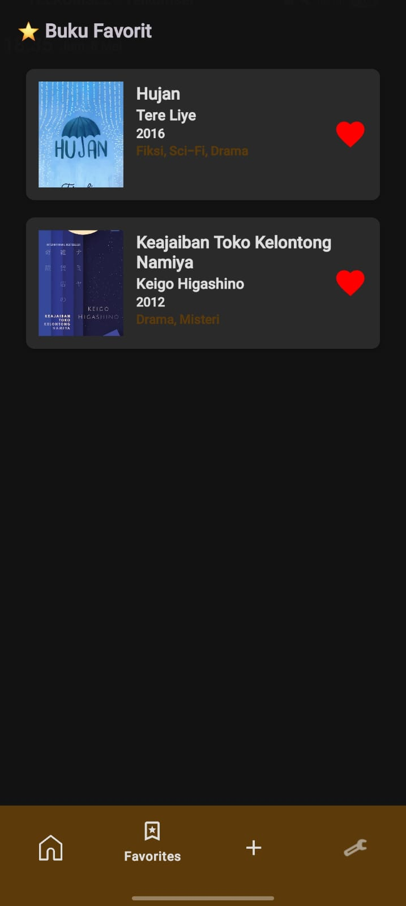
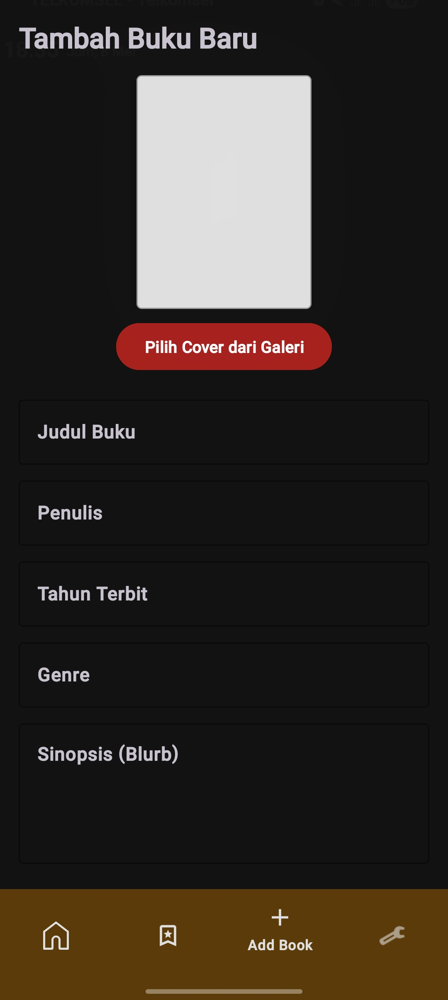
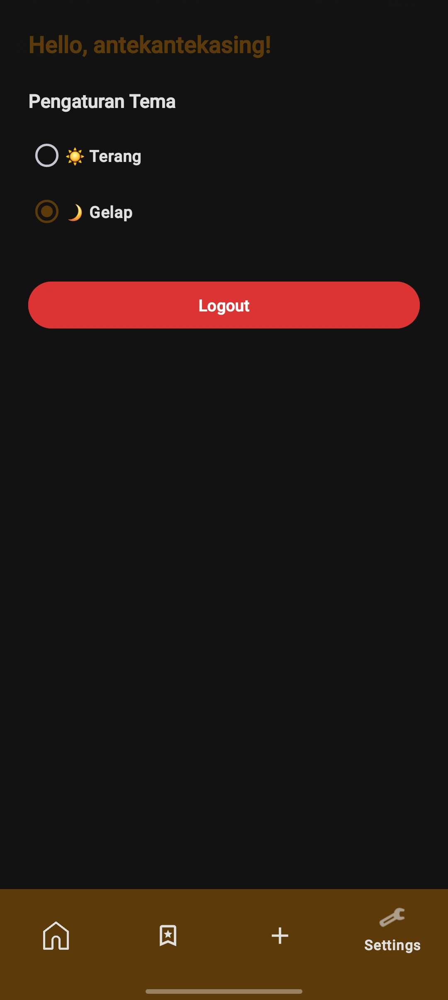
---

# 👨‍💻 Kesimpulan

Aplikasi ini mengimplementasikan:

| Komponen | Status |
|---|---|
| Login & Register dengan SharedPreferences | ✅ |
| Dark/Light Mode | ✅ |
| Show/Hide Password | ✅ |
| Session Management (logout) | ✅ |
| Bottom Navigation | ✅ |
| RecyclerView (search, filter, sorting) | ✅ |
| 15+ data buku dummy | ✅ |
| Tambah buku + galeri | ✅ |
| Detail buku + rating + review | ✅ |
| Like system (favorites) | ✅ |
| Background Thread (AsyncTask) | ✅ |
| ProgressBar loading | ✅ |

---

# 🙏 Terima Kasih

---