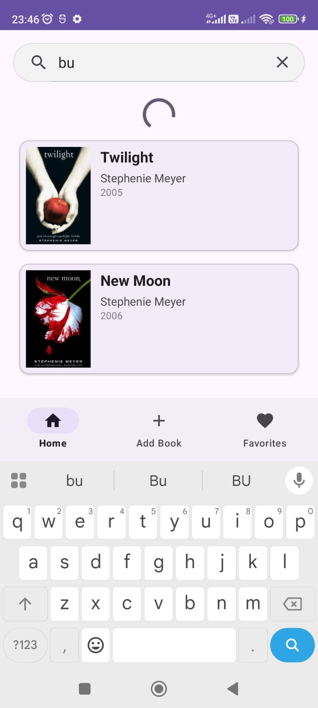
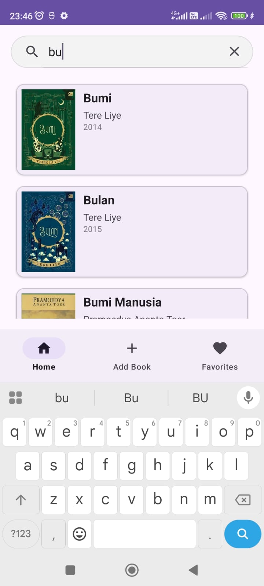
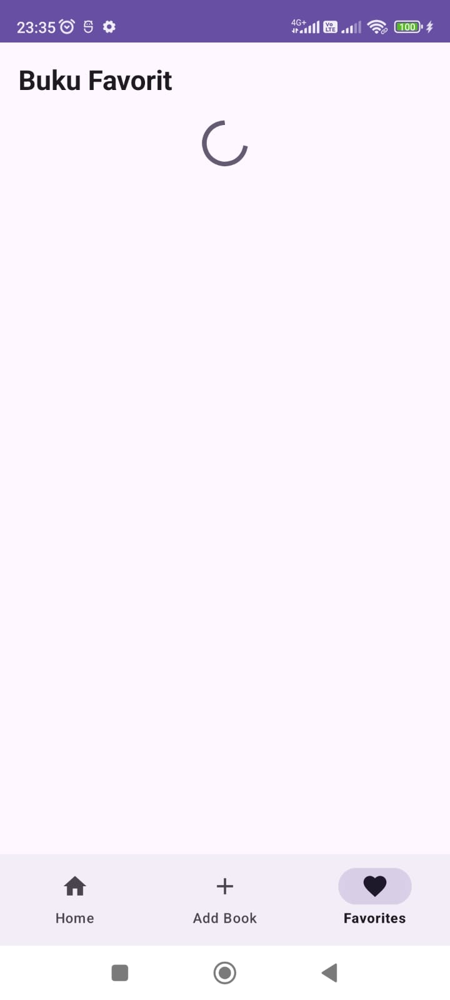

# Library App (V2) - Tugas Praktikum 4: Background Threading

Pengembangan lanjutan dari Library App yang mengintegrasikan pemrosesan latar belakang (*Background Thread*) untuk menjaga responsivitas antarmuka pengguna (UI) saat menangani operasi data.

---

## Deskripsi Tugas
Pada praktikum kali ini, fokus utama adalah optimasi performa aplikasi. Library App kini dilengkapi dengan mekanisme *multi-threading* untuk menangani proses pencarian dan pemuatan data favorit. Hal ini mencegah terjadinya *UI Blocking* atau *lag* yang dapat mengganggu pengalaman pengguna.

---

## Fitur Baru (Optimasi)
* **Asynchronous Search**: Proses filtering buku pada `SearchView` kini berjalan di *Background Thread*.
* **Background Data Loading**: Pemuatan daftar favorit pada `FavoriteFragment` dilakukan secara asinkron.
* **Indikator Progres (ProgressBar)**: Memberikan umpan balik visual kepada pengguna selama proses pengolahan data berlangsung.
* **Thread Safety**: Implementasi pembaruan UI yang aman melalui `Handler` (Main Looper).

---

## Pemahaman Algoritma & Teknis

### 1. Worker Thread dengan ExecutorService
Dibandingkan menggunakan `AsyncTask` yang sudah *deprecated*, aplikasi ini menggunakan **`ExecutorService`** dengan `SingleThreadExecutor`.
* **Algoritma**: Saat instruksi pemicu (seperti mengetik di pencarian) diterima, tugas dipindahkan dari *Main Thread* ke *Worker Thread*.
* **Tujuan**: Memastikan *Main Thread* tetap bebas untuk menangani input pengguna dan animasi UI tanpa interupsi dari proses komputasi.

### 2. UI Synchronization via Handler
Android memiliki kebijakan ketat di mana *Background Thread* tidak diizinkan menyentuh komponen UI secara langsung.
* **Mekanisme**: Setelah proses filter atau pemuatan data selesai di latar belakang, aplikasi menggunakan **`Handler(Looper.getMainLooper())`** untuk mengirimkan instruksi kembali ke *Main Thread*.
* **Fungsi**: Digunakan untuk memperbarui `Adapter` dan mengubah status visibilitas `ProgressBar` dari `VISIBLE` ke `GONE`.

### 3. Simulasi Latensi (Thread Sleep)
Untuk memastikan asisten dapat melihat kinerja `ProgressBar` pada dataset kecil (15 data), digunakan metode `Thread.sleep(500)`. Dalam skenario nyata, ini merepresentasikan waktu tunggu saat aplikasi mengambil data dari server atau database lokal yang besar.

---

## Dokumentasi Hasil Praktikum

### Proses Background Threading
| Animasi Loading (Search) | Hasil Filter (Thread Selesai) | Loading Data Favorites |
| :---: | :---: | :---: |
|  |  |  |
| *ProgressBar tampil saat filter berjalan* | *UI diperbarui setelah thread selesai* | *Proses asinkron saat pindah tab* |

---

## Komponen Teknis Baru
* **Class**: `java.util.concurrent.ExecutorService`
* **Class**: `android.os.Handler`
* **Component**: `android.widget.ProgressBar`
* **Logic**: `Executors.newSingleThreadExecutor()`

---

## Identitas Pengembang
**Nama**: Isnadia Nurfadillah
**NIM**: H071241052  
**Program Studi**: Sistem Informasi  
**Instansi**: Universitas Hasanuddin (Unhas)