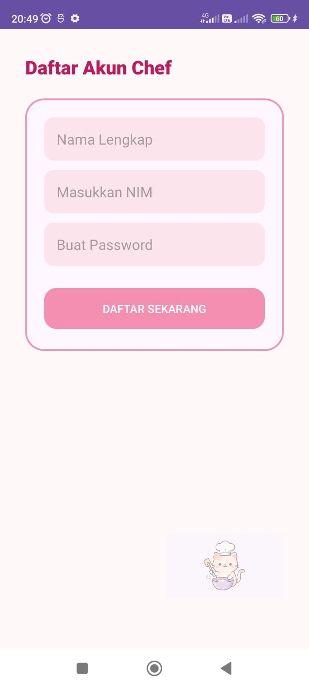
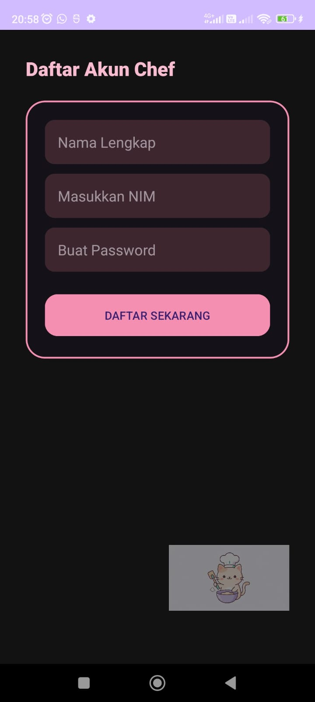
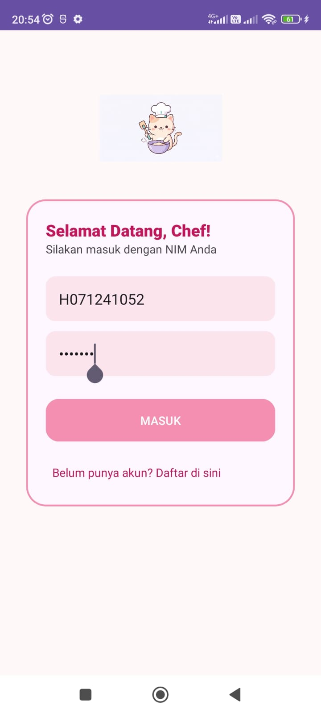
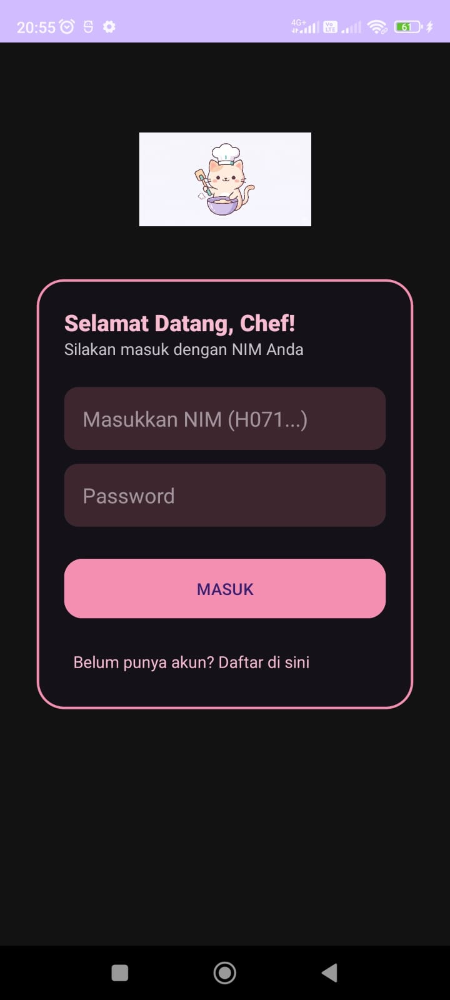
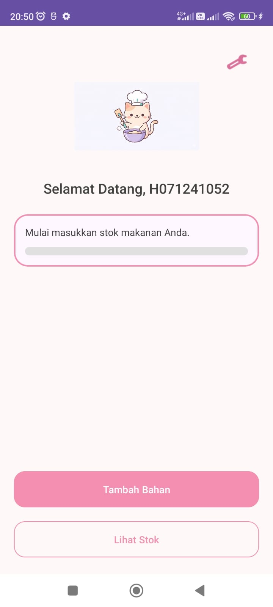
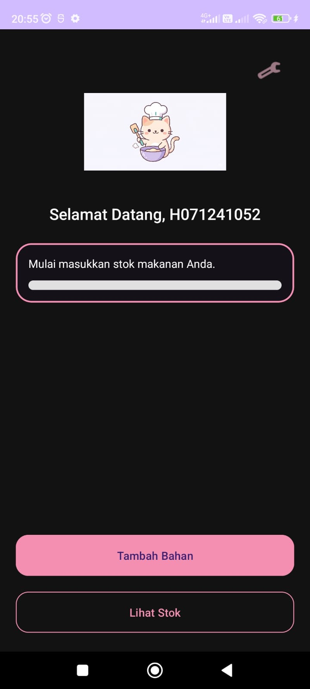
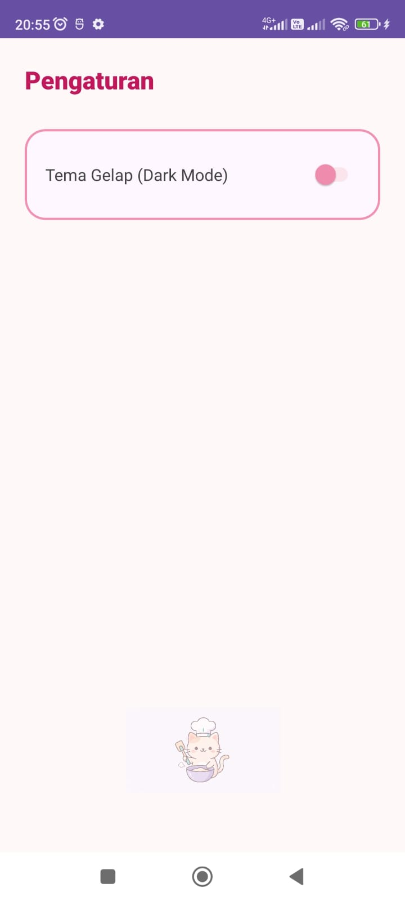
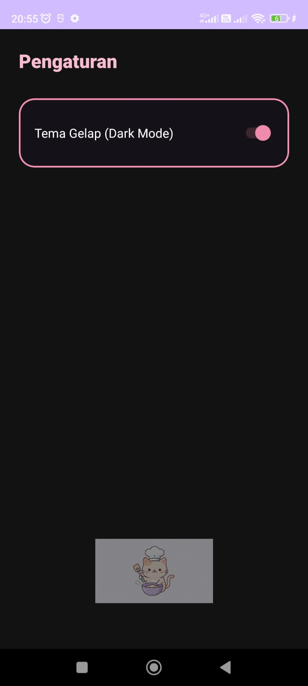

# Food Waste Tracker - Tugas Praktikum 5: UI/UX & Theme Management

Pengembangan aplikasi pemantauan stok makanan yang berfokus pada desain antarmuka pengguna (**UI/UX**) yang kreatif, responsif, serta implementasi sistem tema dinamis (Light/Dark Mode).

---

## Deskripsi Tugas
Praktikum kali ini menekankan pada aspek kreativitas dalam mempercantik tampilan aplikasi menggunakan prinsip *Material Design*. Aplikasi **Food Waste Tracker** kini mengusung konsep **"Pastel Kitchen"** dengan identitas visual **Master Chef Cat**. Fokus teknis utama meliputi manajemen *state* untuk tema dan sinkronisasi data NIM pengguna antar *Activity*.

---

## Fitur Baru (Estetika & Fungsi)
* **Custom Theme "Pastel Kitchen"**: Skema warna *Pink Pastel* yang konsisten pada seluruh komponen UI untuk kesan yang imut dan profesional.
* **Persistent Dark Mode**: Implementasi fitur pengubah tema yang statusnya tersimpan secara permanen menggunakan `SharedPreferences`.
* **Dynamic User Identity**: Menampilkan NIM pengguna secara dinamis pada Dashboard sebagai identitas "Chef" yang sedang aktif.
* **Master Chef Visual Anchors**: Penempatan ikon koki kucing yang ikonik sebagai elemen *branding* di setiap halaman.
* **Enhanced UI Components**: Penggunaan `MaterialCardView` dengan *rounded corner* dan *custom Progress Bar* yang estetik.

---

## Pemahaman Algoritma & Teknis

### 1. Theme Persistence via SharedPreferences
Aplikasi menggunakan **`SharedPreferences`** untuk menjaga konsistensi pilihan tema pengguna bahkan setelah aplikasi ditutup.
* **Algoritma**: Saat *switch* pada halaman *Setting* diaktifkan, nilai boolean disimpan ke penyimpanan internal.
* **Implementasi**: Sebelum `setContentView` di setiap *Activity*, aplikasi membaca nilai tersebut dan menerapkan `AppCompatDelegate.setDefaultNightMode()` yang sesuai.

### 2. Intent Data Passing & Auth Flow
Proses perpindahan data NIM dilakukan melalui mekanisme **`Intent Extras`**.
* **Mekanisme**: NIM yang didaftarkan pada `RegisterActivity` divalidasi di `LoginActivity`. Setelah berhasil, data tersebut dikirimkan ke `MainActivity`.
* **Tujuan**: Memastikan alur registrasi dan login berjalan secara fungsional sebelum pengguna dapat mengakses fitur utama aplikasi.

### 3. Resource Qualifiers (Dark Mode Support)
Untuk mendukung tampilan yang nyaman di mata pada malam hari, aplikasi mengimplementasikan folder **`values-night`**.
* **Teknis**: Warna-warna dideklarasikan ulang dalam file `res/values-night/colors.xml` dengan palet warna gelap (charcoal/navy) namun tetap mempertahankan aksen pink agar identitas aplikasi tetap terjaga.

---

## Dokumentasi Hasil Praktikum

### Perbandingan UI: Light Mode vs Dark Mode

| Halaman | Light Mode (Pastel Pink) | Dark Mode (Pastel Night) |
| :--- | :---: | :---: |
| **Registrasi** |  |  |
| **Login** |  |  |
| **Utama (Dashboard)** |  |  |
| **Pengaturan (Settings)** |  |  |

---

## Komponen Teknis Utama
* **Class**: `android.content.SharedPreferences`
* **Class**: `androidx.appcompat.app.AppCompatDelegate`
* **Layouting**: `ConstraintLayout` & `MaterialCardView`
* **Logic**: `Intent.putExtra()` & `getIntent().getStringExtra()`

---

## Identitas Pengembang
**Nama**: Isnadiyah Nur Fadhilah  
**NIM**: H071241052  
**Program Studi**: Sistem Informasi  
**Instansi**: Universitas Hasanuddin (Unhas)